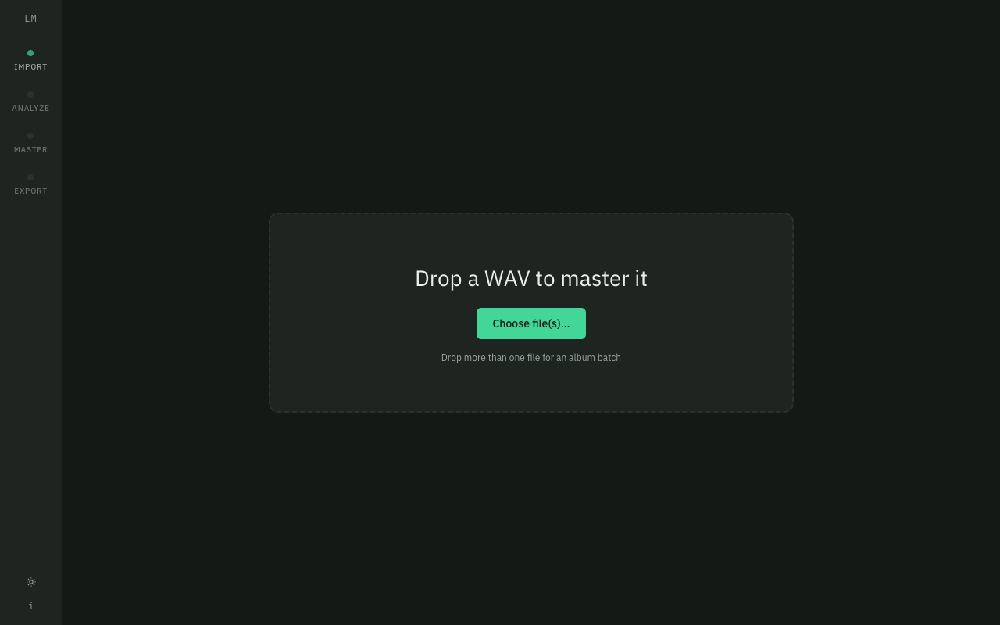

# LocalMaster

Local-first, open-source mastering for your own tracks — built for the
Suno-export → DJ-ready-WAV workflow.

**Deterministic, analysis-driven DSP. Not "AI mastering."** No model guesses at
your sound; the same input with the same settings always produces the
bit-identical output file (there's a test for that).

**100% local.** No uploads, no accounts, no telemetry, no analytics. The audio
engine binds to `127.0.0.1` only, and the repo ships a prover
(`make no-network-proof`) that runs a full analyze→master→export under an
audit hook and fails on any outbound connection.

## Features

- One-flow mastering: import WAV → analyze → **Clean DJ Master** →
  volume-matched A/B → export 24-bit WAV + JSON/TXT report
- Real measurement: BS.1770 integrated/short-term LUFS, true peak (4×
  oversampled), loudness range, spectral balance, clipping/DC/harshness/
  imbalance/silence detection
- 7 presets shipped as **editable defaults** (Clean DJ, Loud Club, Streaming
  Balanced, Warm Analog-ish, Bright Pop, Bass Tightener, Gentle)
- **Transient guard**: hitting −9 LUFS under a −1 dBTP ceiling requires
  limiting; LocalMaster caps *sustained* limiting at a per-preset budget and
  honestly reports when a dynamic track lands quieter than target instead of
  silently crushing it (see `docs/AUDIO_ENGINE.md`)
- Volume-matched A/B so "louder" can't masquerade as "better"
- Album/batch mode with shared-target loudness consistency
- Exports: 24-bit WAV (DJ default), 16-bit with TPDF dither, 32-bit float;
  sidecar JSON + human-readable TXT report with a DJ readiness checklist
- Non-destructive always: your input file is never modified (byte-hash tested)



## Install (macOS, from source)

Prereqs: [Homebrew](https://brew.sh), then:

```bash
brew install uv node rustup && rustup-init -y
git clone https://github.com/molly-diversifiedfun/localmaster.git && cd localmaster
make setup      # uv sync + npm install
make dev        # engine (127.0.0.1:48750) + desktop app
```

Windows/Linux: the engine (`apps/audio-engine`) is pure Python/numpy/scipy and
runs anywhere; the Tauri app builds on both platforms but is untested there —
see the roadmap.

### Build the app

```bash
make app        # freezes the engine, bundles it, builds LocalMaster.app
open apps/desktop/src-tauri/target/release/bundle/macos/LocalMaster.app
```

One command: freezes the audio engine (PyInstaller onedir), copies it into
the Tauri resource bundle, then builds a double-clickable `LocalMaster.app`
with the engine bundled inside — no separate `make engine-dev` needed. The
build is currently unsigned, so the first launch of a copy that macOS has
quarantined (e.g. downloaded or moved via AirDrop) needs **right-click → Open**
instead of a double-click, to bypass Gatekeeper's "unidentified developer"
block.

## How to master a Suno WAV

1. In Suno: Download → **WAV** (not MP3) for your track.
2. `make dev` → LocalMaster opens → drop the WAV on the Import screen.
3. Read the analysis (it will flag clipping, DC, harshness, silence padding).
4. Pick **Clean DJ Master** → Render → use the A/B toggle. It's volume-matched:
   if the master sounds better, it's actually better, not just louder.
5. Tweak the right-panel controls if you want (targets are editable defaults).
6. Export → 24-bit WAV lands next to a `.report.json` + `.report.txt` with the
   DJ readiness checklist. If the transient guard capped loudness, the report
   says exactly what you got and why.

## Development

```bash
make test               # everything
make test-engine        # pytest — includes the 8 acceptance tests
make fixtures           # regenerate synthetic test audio (no copyrighted files)
make sidecar            # freeze engine (PyInstaller onedir) for bundling
make no-network-proof   # audit-hook proof of zero outbound connections
```

Layout: `apps/audio-engine` (Python DSP + FastAPI on loopback) ·
`apps/desktop` (Tauri 2 + React + TS) · `packages/shared` (frozen API
contract) · `docs/` (AUDIO_ENGINE, DJ_EXPORT_GUIDE, plans, ADRs).

## Troubleshooting

- **"Engine not running"** in the app → start it: `make engine-dev`, then
  reload. The app looks for `http://127.0.0.1:48750/health`.
- **Unsupported format / decode error** → the engine reads WAV/FLAC/AIFF/OGG
  (and MP3 where the bundled libsndfile supports it). Re-export WAV from Suno.
- **Export fails with a permissions error** → pick an output folder you own;
  the engine never writes outside the chosen directory.
- **Master lands quieter than target** → that's the transient guard on a
  dynamic track. Raise the loudness priority (GR budget) or accept the punch.
- **MP3 encode disabled** → install ffmpeg yourself (`brew install ffmpeg`);
  LocalMaster never bundles it (license posture, see THIRD_PARTY_NOTICES.md).

## Known limitations (accepted for MVP)

- Quitting the app mid-export SIGTERMs the engine, which can leave a partial
  output file (never the input — that's read-only by construction). Graceful
  drain-then-quit is on the roadmap.
- Engine job errors include absolute local file paths. Deliberate: this is a
  local-only desktop tool and the paths are the user's own; nothing leaves
  the machine.

## Roadmap (post-MVP)

Reference-track matching with a 0–100% strength slider · dynamic low-mid ·
multiband compression · approximate tempo/key labeling (optional extra, never
pipeline-blocking) · packaged .app with bundled sidecar + signing/notarization
· Windows/Linux builds · FLAC export polish.

## License

MIT. Third-party notices: `THIRD_PARTY_NOTICES.md` (all runtime deps
permissive; the LGPL libsndfile dylib ships as a separate replaceable file;
GPL-linked libraries like pedalboard are deliberately excluded).
